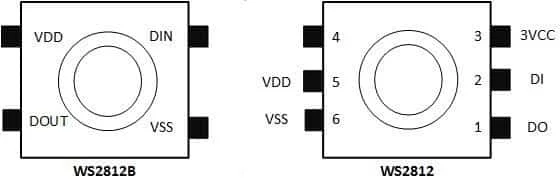
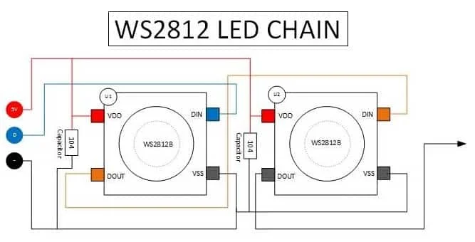
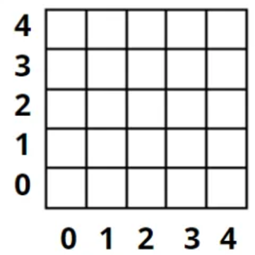
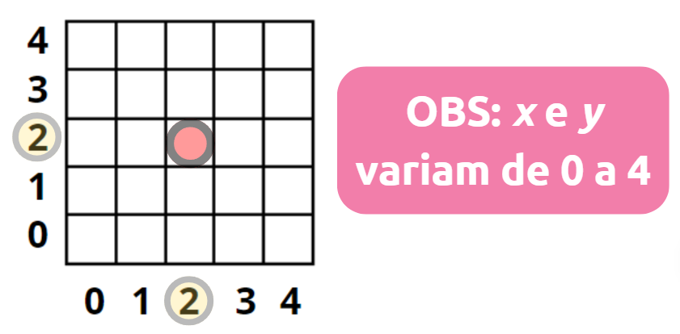
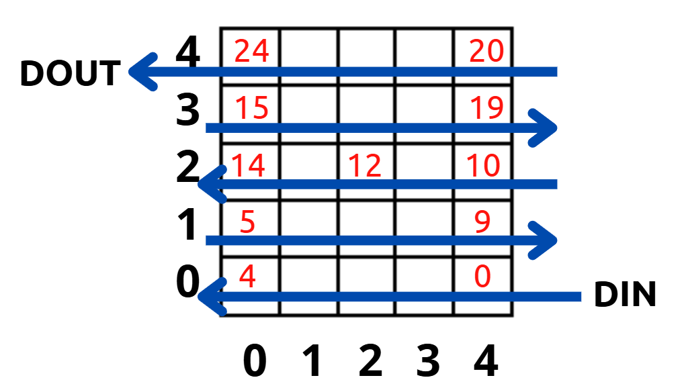
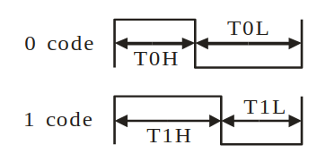
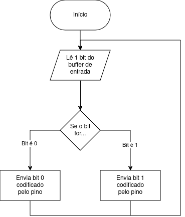
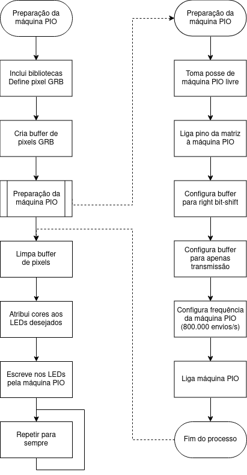
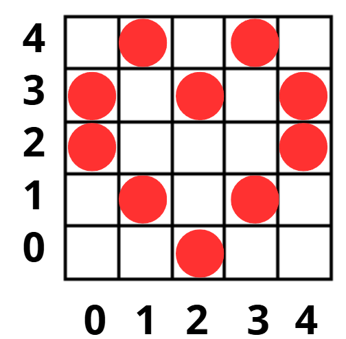

# Matriz de LEDs

## O LED Endereçável

Já vimos que, para controlar um LED RGB, são necessários três sinais individuais, um para cada cor. Imagine aplicar este método para uma matriz de 25 LEDs RGB, dispostos em 5 colunas por 5 linhas: seriam necessários 75 sinais de controle (3 x 25), todos saindo do microcontrolador!

Felizmente, existe uma solução: os LEDs endereçáveis. Apesar de também serem RGB, eles podem ser controlados com apenas um único pino de dados digital. A figura a seguir ilustra o layout básico de um LED endereçável:


Figura: Desenho da vista de planta de um LED RGB endereçável.

Perceba que cada LED endereçável possui 4 terminais. VDD (alimentação positiva), VSS (alimentação negativa), DIN (entrada de dados) e DOUT (saída de dados).

Com essa configuração, um único pino do microcontrolador pode controlar a cor e a intensidade de todos os LEDs da fila. Os terminais VDD e VSS são compartilhados por toda a cadeia. Um esquema simplificado de conexão está ilustrado abaixo.

Este LED tem uma saída (DOUT) que pode ser conectada a um outro LED: assim, em fila, com um único pino, podemos controlar, individualmente, tanto a intensidade como a cor RGB de todos os LEDs desta fila. Os terminais de VDD e VSS são comuns com todos os LEDs da fila. Um esquema simplificado desta conexão é mostrado na figura a seguir:


Figura: Esquema de conexão de dois LEDs endereçáveis.

<details>

<summary>Mais sobre LEDs Endereçáveis</summary>

### LEDs Endereçáveis e Neopixel

Os LEDs endereçáveis, como os baseados no chip controlador WS2812 (e as variantes WS2812B, SK6812), permitem controle individual de cor e intensidade utilizando um único pino de dados digital.

Embora a marca Neopixel, registrada pela Adafruit Industries, seja amplamente conhecida, a tecnologia WS2812 não é proprietária e seu protocolo é documentado e amplamente implementado em bibliotecas de código aberto, como Python e MicroPython.

LEDs compatíveis com essa tecnologia são vendidos sob diferentes nomes, mantendo a mesma funcionalidade, o que facilita seu uso em projetos de iluminação programável.

## ‎‎‎‎‎‎ㅤ
</details>

Esta funcionalidade economiza muitos pinos e permite criar uma fita ou matriz de LEDs que podem ser conectadas em série, aumentando muito a sua capacidade de comunicação visual.

Portanto, usamos apenas um pino de saída digital do microcontrolador para comandar a intensidade e cor de uma fila de LEDs coloridos. A disposição física destes LEDs pode criar letreiros, setas e displays com um efeito visual interessante.

Embora essa tecnologia economize pinos e simplifique o hardware, nem tudo é fácil! O controle desses LEDs exige programação que inclui timing preciso, algo que pode ser desafiador em algumas linguagens.

Linguagens como MicroPython já oferecem bibliotecas prontas que abstraem a complexidade, tornando o processo transparente para o usuário final. No entanto, para entendermos o funcionamento detalhado e aproveitarmos melhor os recursos do microcontrolador, vamos "descer o nível" e implementar esse controle diretamente em linguagem C. Para isso, exploraremos mais alguns detalhes do nosso hardware.

## Detalhes do hardware da matriz de LEDs

A BitDogLab possui 25 LEDs, dispostos em 5 linhas por 5 colunas. Para orientação, vamos nomear cada LED através da sua posição (coluna versus linha) ou então (x, y) onde x indica a posição horizontal, identificando a coluna, e y, a posição vertical, identificando a linha.



Aqui, podemos identificar o LED do centro da matriz com as coordenadas (2,2):



No caso da BitDogLab, a matriz de 25 LEDs endereçáveis está conectada em série da seguinte forma.



Os números em vermelho indicam a posição dos LEDs na fila. Então, utilizaremos um vetor de 25 posições com números inteiros para identificar a posição de cada LED nesta matriz.

Controlar a cor de cada LED em um posição determinada exige precisão temporal para enviar os sinais digitais que determinam a cor e a intensidade de cada LED. O protocolo utilizado pelos LEDs WS2812 é sensível a variações de tempo na ordem de nanosegundos. Implementar esse controle diretamente via software pode ser desafiador e consumir muitos recursos do microcontrolador, como ciclos de processamento e interrupções.

Para resolver esse problema, utilizamos o PIO (Programmable Input/Output) do microcontrolador RP2040. O PIO é um recurso de hardware que permite criar máquinas de estado programáveis capazes de gerar sinais precisos de forma independente, sem sobrecarregar os núcleos principais do microcontrolador.

Com esta abordagem usando  PIO, conseguimos garantir o timing necessário para o protocolo dos LEDs WS2812, liberar o processador para outras tarefas ou reduzir o consumo de energia e simplificar o envio de dados para a matriz de LEDs, tornando o sistema mais eficiente.

<details>

<summary>Mais detalhes sobre o PIO</summary>

### O que é uma Máquina PIO?

No contexto do Raspberry Pi Pico (RP2040), uma máquina PIO (Programmable Input/Output) é uma unidade de hardware altamente configurável que pode executar pequenos programas para manipulação de sinais digitais. Essas máquinas são parte do sistema PIO (Programmable Input/Output), projetado para lidar com tarefas de I/O que exigem precisão de tempo sem sobrecarregar os núcleos de processamento principais (ARM Cortex-M0+).

Cada unidade PIO possui 4 máquinas de estado independentes, e cada máquina pode executar um conjunto de instruções simples para gerar e/ou processar sinais digitais. No caso do código para controle de LEDs endereçáveis, como o WS2812, a máquina PIO é usada para:

- Gerar os pulsos de dados com a precisão temporal necessária para o protocolo WS2812.
- Transmitir os valores de cor dos LEDs (em formato GRB) no timing correto.

### Características da Máquina PIO:

- **Precisão Temporal:** Permite gerar pulsos e sinais precisos, essenciais para protocolos como o dos LEDs WS2812.
- **Independência do Processador:** As máquinas PIO funcionam de forma independente, liberando os núcleos ARM para outras tarefas ou permitindo que eles entrem em modo de baixa potência.
- **Configuração Flexível:** As máquinas podem ser programadas para várias funções de I/O, como geração de PWM, SPI personalizado, UART, ou controle de LEDs endereçáveis.
## ‎‎‎‎‎‎‎‎ㅤ
</details>

Agora que entendemos a importância do PIO para o controle preciso da matriz de LEDs, vamos detalhar o funcionamento da função npWrite. Essa função utiliza a máquina PIO para enviar os dados de cor, armazenados no buffer da matriz de LEDs, diretamente ao hardware. No entanto, como veremos, essa função apenas transmite os dados do buffer para os LEDs, e, por isso, é necessário que as cores sejam definidas previamente no buffer para que os LEDs acendam. A função npWrite organiza os dados e envia para o PIO, enquanto o PIO cuida do trabalho de baixo nível, como o timing preciso necessário para os LEDs.

A seguir, exploraremos como configurar e utilizar a PIO para controlar os LEDs endereçáveis da BitDogLab, detalhando cada etapa do processo de inicialização e operação da matriz:

Para enviar cada bit seguindo [o datasheet do WS2818B](https://cdn-shop.adafruit.com/datasheets/WS2812B.pdf), precisamos enviar cada bit de forma codificada, como mostrado nas imagens abaixo:



| Tipo  | Tempo | Incerteza |
| :---: | :---: |   :---:   |
| T0H | 0,4 µs | ± 150 ns |
| T1H | 0,8 µs | ± 150 ns |
| T0L | 0,85 µs | ± 150 ns |
| T1L | 0,45 µs | ± 150 ns |

Além disso, cada bit precisa ser enviado dentro de um tempo de 1,25 ± 0,6 µs.

Com essas informações, podemos desenvolver um programa que envia bits codificados a uma velocidade de 1,25 µs/bit, ou seja, uma taxa de bits de 800.000 bits/s ou 800 kHz. Além disso, o programa deve ser capaz de trocar o estado do pino em momentos específicos dentro do envio de cada bit, ou seja, a frequência de operação (leia-se, frequência de clock) precisa ser maior que a taxa de envio. Para isso, podemos ter uma frequência de clock de 8MHz, 10 vezes maior que a taxa de envio de bits; com isso, temos uma capacidade de 10 instruções por bit enviado.

Usando um buffer para armazenar os bits a serem enviados, o nosso programa deve seguir a seguinte lógica:

  
Fluxograma: Operação com PIO.

## Pseudocódigo - Código da Máquina de Estados do PIO

Usando a interface PIO da extensão da Raspberry Pi Pico, montamos o programa abaixo:  
**Este código deve ser colocado em um arquivo de nome ws2818b.pio, que deve ser criado no diretório do projeto.**

**Preparação do programa:** Aqui, preparamos o programa que será executado pelo sistema PIO.

```ruby
.program ws2818b
```

O “.side_set 1” habilita uma funcionalidade chamada “side set”, que usaremos para modificar o valor do pino de forma simultânea a instruções do programa.

```ruby
.side_set 1
```

O “.wrap_target” serve para explicitar o início do loop do programa principal.

**Loop do programa:** O programa usa de dois recursos, o side set e um delay. Toda instrução tem o seguinte formato:

> inst args...    side 0/1  [delay]

O programa consiste de quatro passos, listados abaixo.
- Ler 1 bit do buffer de entrada (escreve 0 no pino; essa instrução demora 2 ciclos de clock);
- Se o bit lido for 0, pule a próxima linha (escreve 1 no pino; demora 1 ciclo);
- Volte ao primeiro passo (escreve 1 no pino; demora 4 ciclos);
- Não faça nada (escreve 0 no pino; demora 4 ciclos);

```ruby
	out x, 1    	side 0 [2]


	jmp !x, 3   	side 1 [1]

	jmp 0       	side 1 [4]

	nop         	side 0 [4]
```

**Fim do loop:** O “.wrap” indica o fim do loop do programa.

```ruby
.wrap
```  
**Função de inicialização do ws2818b:**

```ruby
% c-sdk {
#include "hardware/clocks.h"

void ws2818b_program_init(PIO pio, uint sm, uint offset, uint pin, float freq) {

  pio_gpio_init(pio, pin);
  
  pio_sm_set_consecutive_pindirs(pio, sm, pin, 1, true);
  
  // Program configuration.
  pio_sm_config c = ws2818b_program_get_default_config(offset);
  sm_config_set_sideset_pins(&c, pin); // Uses sideset pins.
  sm_config_set_out_shift(&c, true, true, 8); // 8 bit transfers, right-shift.
  sm_config_set_fifo_join(&c, PIO_FIFO_JOIN_TX); // Use only TX FIFO.
  float prescaler = clock_get_hz(clk_sys) / (10.f * freq); // 10 cycles per transmission, freq is frequency of encoded bits.
  sm_config_set_clkdiv(&c, prescaler);
  
  pio_sm_init(pio, sm, offset, &c);
  pio_sm_set_enabled(pio, sm, true);
}
%}


```  


**Preparação do Ambiente e Configuração da Máquina PIO:** Primeiro, incluímos as bibliotecas necessárias, definimos parâmetros como o número de LEDs e o pino de dados, e criamos o buffer de pixels. Em seguida, a máquina PIO é preparada para gerenciar os sinais necessários ao controle dos LEDs.

**Configuração Específica da Máquina PIO:** Configuramos a máquina PIO para ajustar o buffer, transmitir os sinais de controle e operar na frequência necessária para o protocolo WS2812. O programa PIO é carregado na máquina e associado ao pino de saída do microcontrolador. **Para isso deve-se criar um arquivo chamado ws2812b.pio no diretório do projeto, cujo conteúdo será o código disponibilizado acima. Este arquivo então irá gerar uma biblioteca que será utilizada pelo código.**  


**Operação da Matriz de LEDs:** Durante a execução do programa, o buffer de pixels é limpo, as cores desejadas são atribuídas aos LEDs, e os dados são enviados para a matriz por meio da função npWrite. Esse ciclo pode ser repetido continuamente para atualizar os LEDs conforme necessário.

O fluxograma, mostrado a seguir, detalha essas etapas, permitindo uma visão geral clara e estruturada do processo. No programa que acompanha este sistema, a matriz de LEDs é configurada e inicializada corretamente, mas, inicialmente, os LEDs permanecem apagados porque o buffer de pixels (leds) não é modificado antes de chamar a função npWrite:


Fluxograma: Processo de configuração e controle da matriz de LEDs com PIO.

## Pseudocódigo - Linguagem C

**Inclusão de bibliotecas:** Incluímos as bibliotecas padrão <stdio.h> e “pico/stdlib.h” e também as bibliotecas “hardware/pio.h” e “hardware/clocks.h”, que são utilizadas para configurar o sistema PIO.

```c
#include <stdio.h>
#include "pico/stdlib.h"
#include "hardware/pio.h"
#include "hardware/clocks.h"
```

Durante a compilação, é gerada uma biblioteca auxiliar “ws2818b.pio.h” baseada no conteúdo do arquivo “ws2818b.pio”. O arquivo contém um programa de instruções básicas para a máquina de estados e uma função de inicialização em C.

Para mais detalhes, [leia este arquivo no GitHub](https://github.com/BitDogLab/BitDogLab-C/blob/main/neopixel_pio/ws2818b.pio).

```c
// Biblioteca gerada pelo arquivo .pio durante compilação.
#include "ws2818b.pio.h"
```

**Definição de número de LEDs e do pino do GPIO do microcontrolador:**

```c
// Definição do número de LEDs e pino.
#define LED_COUNT 25
#define LED_PIN 7
```

**Definição de pixel GRB:** Aqui, usamos um struct para definir o que é um pixel dentro do nosso código.

```c
// Definição de pixel GRB
struct pixel_t {
 uint8_t G, R, B; // Três valores de 8-bits, cada um, compõem um pixel.
};
```

Depois, usamos typedef para renomear “struct pixel_t” para apenas “pixel_t”, e depois “npLED_t”.

```c
typedef struct pixel_t pixel_t;
typedef pixel_t npLED_t; // Mudança de nome de "struct pixel_t" para "npLED_t", por clareza.
```

**Declaração do buffer de LEDs:** Criamos uma variável buffer que armazena os dados de cor dos LEDs da matriz.

```c
// Declaração do buffer de pixels que formam a matriz.
npLED_t leds[LED_COUNT];
```

**Declaração das variáveis da máquina PIO:** Também criamos variáveis para acompanhar o status da máquina PIO utilizada.

```c
// Variáveis para uso da máquina PIO.
PIO np_pio;
uint sm;
```

**Função de inicialização da matriz de LEDs NeoPixel:** Para facilitar nossa operação da matriz de LEDs, criamos uma função de inicialização dos recursos que serão utilizados.

```c
/**
* Inicializa a máquina PIO para controle da matriz de LEDs.
*/
void npInit(uint pin) {
```

Primeiro, a função cria o programa PIO configurado no arquivo “ws2818b.pio” e registra a unidade PIO na variável np_pio.

```c
 // Cria programa PIO.
 uint offset = pio_add_program(pio0, &ws2818b_program);
 np_pio = pio0;
```

Depois, tomamos posse de uma máquina de estados do sistema PIO para podermos executar o programa ws2818b.pio. Se nenhuma máquina estiver livre, o programa dá erro e para.

```c
 // Toma posse de uma máquina PIO.
 sm = pio_claim_unused_sm(np_pio, false);
 if (sm < 0) {
   np_pio = pio1;
   sm = pio_claim_unused_sm(np_pio, true); // Se nenhuma máquina estiver livre, panic!
 }
```

Ao obter os recursos do microcontrolador necessários, inicializamos o programa que será executado na máquina de estados do sistema PIO.

```c
 // Inicia programa na máquina PIO obtida.
 ws2818b_program_init(np_pio, sm, offset, pin, 800000.f);
```

Por fim, limpamos o buffer de LEDs.

```c
 // Limpa buffer de pixels.
 for (uint i = 0; i < LED_COUNT; ++i) {
   leds[i].R = 0;
   leds[i].G = 0;
   leds[i].B = 0;
 }
}
```

**Funções de operação da matriz de LEDs:** Criamos diversas funções para facilitar nossa operação.

A função npSetLED modifica a cor do LED do índice selecionado. Note que isso é feito pela modificação dos valores no buffer leds.

```c
/**
* Atribui uma cor RGB a um LED.
*/
void npSetLED(const uint index, const uint8_t r, const uint8_t g, const uint8_t b) {
 leds[index].R = r;
 leds[index].G = g;
 leds[index].B = b;
}
```

A função npClear limpa o buffer leds, ou seja, zera todos os valores de cor.

```c
/**
* Limpa o buffer de pixels.
*/
void npClear() {
 for (uint i = 0; i < LED_COUNT; ++i)
   npSetLED(i, 0, 0, 0);
}
```

A função npWrite escreve os valores do buffer leds nos LEDs  físicos, ou seja, ele envia os dados do buffer usando o sistema PIO do microcontrolador. Ele escreve os dados na ordem GRB, um byte por vez.

```c
/**
* Escreve os dados do buffer nos LEDs.
*/
void npWrite() {
 // Escreve cada dado de 8-bits dos pixels em sequência no buffer da máquina PIO.
 for (uint i = 0; i < LED_COUNT; ++i) {
   pio_sm_put_blocking(np_pio, sm, leds[i].G);
   pio_sm_put_blocking(np_pio, sm, leds[i].R);
   pio_sm_put_blocking(np_pio, sm, leds[i].B);
 }
}
```

**Execução do programa principal:** Como sempre, nossa função main demarca o que será feito durante a execução do nosso programa compilado. Inicializamos os recursos da matriz de LEDs pela função npInit e limpamos o buffer com npClear.

```c
int main() {

 // Inicializa entradas e saídas.
 stdio_init_all();

 // Inicializa matriz de LEDs NeoPixel.
 npInit(LED_PIN);
 npClear();
```

Nesse espaço, o programador modificaria o buffer leds para transmitir a imagem desejada para a matriz de LEDs.

```c
 // Aqui, você desenha nos LEDs.
npSetLED(0, 255, 0, 0); // Define o LED de índice 0 para vermelho.
npSetLED(12, 0, 255, 0); // Define o LED de índice 12 (centro da matriz) para verde.
```

Depois de modificar o buffer, escrevemos os dados nos LEDs e não fazemos mais nada.

```c
 npWrite(); // Escreve os dados nos LEDs.

 // Não faz mais nada. Loop infinito.
 while (true) {
   sleep_ms(1000);
 }
}
```

## Código Completo em C

```c
#include <stdio.h>
#include "pico/stdlib.h"
#include "hardware/pio.h"
#include "hardware/clocks.h"

// Biblioteca gerada pelo arquivo .pio durante compilação.
#include "ws2818b.pio.h"

// Definição do número de LEDs e pino.
#define LED_COUNT 25
#define LED_PIN 7

// Definição de pixel GRB
struct pixel_t {
 uint8_t G, R, B; // Três valores de 8-bits compõem um pixel.
};
typedef struct pixel_t pixel_t;
typedef pixel_t npLED_t; // Mudança de nome de "struct pixel_t" para "npLED_t" por clareza.

// Declaração do buffer de pixels que formam a matriz.
npLED_t leds[LED_COUNT];

// Variáveis para uso da máquina PIO.
PIO np_pio;
uint sm;

/**
* Inicializa a máquina PIO para controle da matriz de LEDs.
*/
void npInit(uint pin) {

 // Cria programa PIO.
 uint offset = pio_add_program(pio0, &ws2818b_program);
 np_pio = pio0;

 // Toma posse de uma máquina PIO.
 sm = pio_claim_unused_sm(np_pio, false);
 if (sm < 0) {
   np_pio = pio1;
   sm = pio_claim_unused_sm(np_pio, true); // Se nenhuma máquina estiver livre, panic!
 }

 // Inicia programa na máquina PIO obtida.
 ws2818b_program_init(np_pio, sm, offset, pin, 800000.f);

 // Limpa buffer de pixels.
 for (uint i = 0; i < LED_COUNT; ++i) {
   leds[i].R = 0;
   leds[i].G = 0;
   leds[i].B = 0;
 }
}

/**
* Atribui uma cor RGB a um LED.
*/
void npSetLED(const uint index, const uint8_t r, const uint8_t g, const uint8_t b) {
 leds[index].R = r;
 leds[index].G = g;
 leds[index].B = b;
}

/**
* Limpa o buffer de pixels.
*/
void npClear() {
 for (uint i = 0; i < LED_COUNT; ++i)
   npSetLED(i, 0, 0, 0);
}

/**
* Escreve os dados do buffer nos LEDs.
*/
void npWrite() {
 // Escreve cada dado de 8-bits dos pixels em sequência no buffer da máquina PIO.
 for (uint i = 0; i < LED_COUNT; ++i) {
   pio_sm_put_blocking(np_pio, sm, leds[i].G);
   pio_sm_put_blocking(np_pio, sm, leds[i].R);
   pio_sm_put_blocking(np_pio, sm, leds[i].B);
 }
}

int main() {

 // Inicializa entradas e saídas.
 stdio_init_all();

 // Inicializa matriz de LEDs NeoPixel.
 npInit(LED_PIN);
 npClear();

 // Aqui, você desenha nos LEDs.
 npSetLED(0, 255, 0, 0); // Define o LED de índice 0 para vermelho.
 npSetLED(12, 0, 255, 0); // Define o LED de índice 12 (centro da matriz) para verde.

 npWrite(); // Escreve os dados nos LEDs.

 // Não faz mais nada. Loop infinito.
 while (true) {
   sleep_ms(1000);
 }
}
```
## Arquivo CMake

Lembre-se que antes de validar nosso algoritmo precisamos fazer algumas definições de compilação usando o CMake.

O arquivo CMakeLists.txt é essencial para configurar como o programa será compilado e vinculado às bibliotecas necessárias. Ele atua como uma "receita" para o CMake criar o arquivo binário final que será carregado na Raspberry Pi Pico.

Considere que o nome do projeto é "neopixel_pio".

## CMakeLists.txt

```ruby
# Defina a versão mínima do CMake
cmake_minimum_required(VERSION 3.13)

# Nome do projeto
project(neopixel_pio)

# Inclui os arquivos do SDK da Raspberry Pi Pico
include(pico_sdk_import.cmake)

# Inicializa o SDK do Raspberry Pi Pico
pico_sdk_init()

#Generate PIO header
pico_generate_pio_header(neopixel_pio ${CMAKE_CURRENT_LIST_DIR}/ws2818b.pio)

# Define o executável do projeto, especificando o arquivo principal (microphone_adc_example.c)
add_executable(neopixel_pio
        neopixel_pio.c
        )

# Vincula as bibliotecas necessárias para o funcionamento do programa
target_link_libraries(neopixel_pio
    pico_stdlib 
    hardware_pio
    hardware_clocks
)

# Gera arquivos adicionais como .map, .bin, .hex, etc., necessários para a programação do microcontrolador
pico_add_extra_outputs(neopixel_pio)

# Define a URL de referência para este exemplo (opcional)
# Isso é útil se você estiver compartilhando o código e quiser apontar para uma fonte online
example_auto_set_url(neopixel_pio)
```


## Funções do Código

### Função: npInit(uint pin)

**Sintaxe:** npInit(uint pin)

- **Propósito:** Inicializa a máquina PIO e prepara o sistema para controlar os LEDs.
- **O que faz:**
    - Carrega o programa PIO (ws2818b.pio) na máquina PIO (pio0 ou pio1).
    - Reserva uma máquina de estado (sm) para executar o programa PIO.
    - Configura a frequência de operação do PIO para transmitir os dados no protocolo WS2812.
    - Inicializa o buffer leds[] com todos os LEDs apagados.
- **Resumo:** Configura o hardware e deixa tudo pronto para operar os LEDs.

### Função: npSetLED

**Sintaxe:** npSetLED(const uint index, const uint8_t g, const uint8_t r, const uint8_t b)

- **Propósito:** Modificar os valores de cor (G, R, B) no buffer leds[], que é uma representação em memória da matriz de LEDs. Os valores de G, B e R são inteiros de 1 byte, ou seja 0 a 25510. O que corresponde a intensidade de 0 a 100%, respectivamente.
- **O que faz:**
    - Modifica os valores G, R e B de um LED no índice index do buffer. Na BitDogLab, index é um inteiro de 0 a 24.
- **Resumo:** Usamos npSetLED para preparar os dados que desejamos enviar para os LEDs físicos. Mas esta função não envia os dados para o hardware.

**Exemplo:**

```c
npSetLED(0, 255, 0, 0); // Define o LED de índice 0 para vermelho.
npSetLED(12, 0, 255, 0); // Define o LED de índice 12 (centro da matriz) para verde.
```

### Função: npClear

**Sintaxe:** npClear()

- **Propósito:** Apaga todos os LEDs da matriz.
- **O que faz:**
    - Usa npSetLED para definir todos os LEDs no buffer com os valores (0, 0, 0) (cor apagada).
- **Resumo:** Reseta o buffer para apagar todos os LEDs.

### Função: npWrite

**Sintaxe:** npWrite()

- **Propósito:** Envia os valores armazenados no buffer leds[] para os LEDs físicos por meio da máquina PIO.
- **Como Funciona:**
    - A função lê os valores do buffer leds[] (que você configurou com npSetLED) e os transmite para os LEDs na ordem certa usando o protocolo WS2812.
    - É esta função que faz os LEDs acenderem fisicamente com as cores especificadas no buffer.
- **O que faz:**
    - Lê cada LED no buffer e transmite os valores de cor G, R, e B para a máquina PIO, que os converte em pulsos elétricos precisos.
- **Resumo:** Ao chamar essa função, os valores definidos no buffer de LEDs (com npSetLED) são enviados para a matriz de LEDs físicos, atualizando as cores visíveis.

### Função: main()

- **Propósito:** Ponto de entrada do programa, define o fluxo principal de execução.
- **O que faz:**
    - Inicializa as entradas e saídas com stdio_init_all.
    - Chama npInit para configurar o PIO e limpar o buffer.
    - Chama npClear para garantir que os LEDs comecem apagados.
    - Espaço reservado para desenhar nos LEDs: O programador pode modificar o buffer com npSetLED antes de chamar npWrite.
    - Chama npWrite para enviar os dados ao hardware.
    - Entra em um loop infinito (while (true)) sem realizar mais ações.
**Resumo:** Configura o sistema, atualiza os LEDs uma vez e fica ocioso.

## Resumo Geral:

- **npInit:** Configura o PIO e o buffer de LEDs.
- **npSetLED:** Define a cor de um LED específico no buffer.
- **npClear:** Apaga todos os LEDs no buffer.
- **npWrite:** Envia os dados do buffer para os LEDs físicos.
- **main:** Controla o fluxo do programa, inicializa o sistema e atualiza os LEDs.

| Função | O que faz | Quando usar |
|  :---  |   :---    |    :---     |
| npSetLED | Modifica os valores de cor (R, G, B) no buffer leds[]. | Sempre que quiser definir ou alterar a cor de um LED antes de enviá-la ao hardware. |
| npWrite | Envia os valores do buffer leds[] para os LEDs físicos, atualizando as cores visíveis. | Sempre que quiser que as alterações feitas com npSetLED sejam exibidas nos LEDs físicos. |
| npClear | Reseta o buffer de LEDs, apagando todos os LEDs (define os valores de cor para (0, 0, 0)). | Sempre que quiser apagar todos os LEDs da matriz. |
| npInit | Inicializa a máquina PIO, configura o programa para controlar os LEDs e limpa o buffer. | Sempre que o programa for iniciado ou precisar reconfigurar a matriz de LEDs. |
| main | Ponto de entrada do programa, inicializa o sistema e controla o fluxo principal de execução. | Usada automaticamente para definir o que o programa fará durante sua execução. |

Nos próximos passos, veremos como preencher esse buffer com as cores desejadas, explorando o potencial completo da matriz de LEDs endereçáveis da BitDogLab.

### Exemplo Completo 1:

Aqui está um exemplo que demonstra o uso das funções:

```c
int main() {
    // Inicializa o sistema.
    stdio_init_all();
    npInit(LED_PIN);
    npClear(); // Garante que todos os LEDs comecem apagados.

    // Passo 1: Define a cor de alguns LEDs no buffer.
    npSetLED(0, 255, 0, 0);  // Define o LED de índice 0 para vermelho.
    npSetLED(12, 0, 255, 0); // Define o LED de índice 12 (centro) para verde.
    npSetLED(24, 0, 0, 255); // Define o LED de índice 24 para azul.

    // Passo 2: Envia os valores do buffer para os LEDs físicos.
    npWrite(); // Agora os LEDs acendem com as cores especificadas.

    // Loop infinito (nenhuma atualização adicional).
    while (true) {
        sleep_ms(1000);
    }
}
```
  
### Exemplo Completo 2:

Aqui está um exemplo que demonstra o uso de loops da função “for” para criar desenhos:  

```c
int main() {
    // Inicializa o sistema.
    stdio_init_all();
    npInit(LED_PIN);
    npClear(); // Garante que todos os LEDs comecem apagados.

 // Cria desenhos acendendo LEDs em sequência. Quando todos os LEDs estão acesos, todos os LEDs são apagados (npClear) e o loop reinicia.
 while (true) {	
    for (int i = 1; i < 26; i++) {
    npSetLED(i-1, 50, 0, 0);
    npWrite();
    sleep_ms(1000/i);
    }
    sleep_ms(500);
    npClear();
 }
}

```
### Ajuste de vetor para matriz:

Na BitDogLab, o índice fornecido na função npsetLED corresponde à posição do LED na fila, indo de 0 até 24 para a matriz de 25 LEDs.


### Como funciona o índice:

- O LED no índice 0 é o primeiro da fila, ou seja, o LED conectado diretamente ao pino do microcontrolador.
- O LED no índice 1 é o segundo da fila, recebendo o sinal através do LED 0.
- Assim por diante, até o LED no índice 24, que é o último da fila.

**Relação com a posição física na matriz:**

A matriz de LEDs na BitDogLab é organizada em um formato 5x5 (5 colunas por 5 linhas), mas, eletronicamente, os LEDs são conectados em fila. Isso significa que:

- O índice 0 pode corresponder, por exemplo, ao LED no canto superior esquerdo da matriz.
- O índice 24 pode ser o LED no canto inferior direito (dependendo de como os LEDs estão fisicamente ordenados na matriz).

Se desejamos manipular os LEDs com base em suas posições (x, y) na matriz, precisamos fazer uma conversão entre os índices da fila e as coordenadas da matriz. Uma Função para Converter Coordenadas (x, y) para Índice da Fila pode resolver este problema:

```c
/**
 * Converte as coordenadas (x, y) na matriz 5x5 para o índice da fila linear.
 * 
 * @param x A coluna (0 a 4).
 * @param y A linha (0 a 4).
 * @return O índice correspondente na fila (0 a 24).
 */
int getIndex(int x, int y) {
    // Se a linha for par (0, 2, 4), percorremos da esquerda para a direita.
    // Se a linha for ímpar (1, 3), percorremos da direita para a esquerda.
    if (y % 2 == 0) {
        return y * 5 + x; // Linha par (esquerda para direita).
    } else {
        return y * 5 + (4 - x); // Linha ímpar (direita para esquerda).
    }
}
```

## Exercício:

Crie uma função “leds” com os seguintes argumentos:

> leds(x, y, r, g, b)

Sendo que x e y definem a posição do LED na matriz e r, g e b definem a intensidade de cor variando de 0 a 100%. Portanto, 0 ≤ x ≤ 4, 0 ≤ y ≤ 4, 0 ≤ r ≤ 100, 0 ≤ g ≤ 100 e 0 ≤ b ≤ 100.

Use esta função e faça um programa para acender um coração vermelho na matriz da BitDogLab, como mostra a figura:


